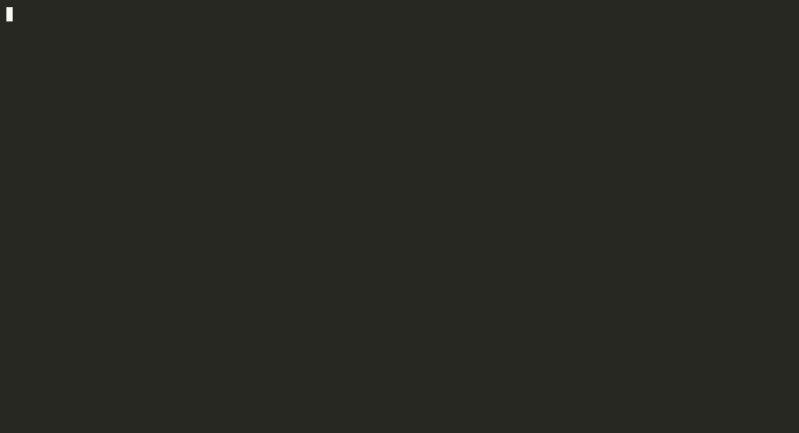

<p align="center">
  
  
  
</p>

<p align="center">
  <b>unfold</b> — inspect any EVM contract in seconds
</p>

<p align="center">
  <!-- demo GIF goes here -->
  
</p>

---

## Install

```bash
npm install -g unfold-evm
```

Requires Node.js 18+.

## Quick start

```bash
# fingerprint a contract
unfold 0x7f39C581F595B53c5cb19bD0b3f8dA6c935E2Ca0

# interactive mode — pick address and action from menus
unfold
```

After the fingerprint, `unfold` drops into an interactive menu so you can keep exploring without retyping the address.

## What you get

- **Fingerprint** — name, standards (ERC-20, ERC-721, ERC-4626 …), compiler, license, balance, total supply
- **Proxy analysis** — detects EIP-1967 Transparent, UUPS, Beacon, Diamond, Minimal Proxy; shows implementation address, admin, and upgrade history
- **Inheritance tree** — full parent chain parsed from Solidity source
- **Security surface** — upgradeability, `selfdestruct`, `tx.origin`, `delegatecall`, reentrancy guards, unprotected privileged functions
- **Read state** — call any `view` function by name with arguments
- **Watch events** — stream decoded events live to the terminal
- **Inspect storage** — read any slot by index, variable name, or mapping key
- **Export** — Foundry fork test stub, ABI JSON, full contract JSON

## Usage

```bash
unfold <address> [options]
```

| Option | Description |
|---|---|
| `--chain <name>` | Target chain (default: `mainnet`) |
| `--rpc <url>` | Override RPC for this run |
| `--proxy` | Proxy analysis + upgrade history |
| `--tree` | Inheritance tree + detected standards |
| `--security` | Security surface scan |
| `--read "<fn(args)>"` | Call a view function |
| `--watch <event\|all>` | Stream live events |
| `--storage <slot\|name\|mapping>` | Read a storage slot |
| `--export <foundry\|abi\|json>` | Export artifacts |
| `--json` | Machine-readable output, no banner or menu |

### Examples

```bash
# proxy deep-dive on wstETH
unfold 0x7f39C581F595B53c5cb19bD0b3f8dA6c935E2Ca0 --proxy

# call totalSupply on USDC (Base)
unfold 0x833589fCD6eDb6E08f4c7C32D4f71b54bdA02913 --chain base --read "totalSupply()"

# read a mapping slot
unfold 0xC02aaA39b223FE8D0A0e5C4F27eAD9083C756Cc2 --storage "balanceOf[0xd8dA6BF26964aF9D7eEd9e03E53415D37aA96045]"

# stream Transfer events live
unfold 0xC02aaA39b223FE8D0A0e5C4F27eAD9083C756Cc2 --watch Transfer

# export a Foundry fork test
unfold 0xC02aaA39b223FE8D0A0e5C4F27eAD9083C756Cc2 --export foundry
```

## Supported chains

`mainnet` · `arbitrum` · `base` · `optimism` · `polygon` · `zksync` · `sepolia` · `holesky`

## Configuration

Source lookups use Etherscan API V2. Without an API key, `unfold` falls back to Sourcify automatically — no key required for most verified contracts.

To use your own Etherscan key:

```bash
# one-off
export ETHERSCAN_API_KEY=your_key_here

# or persist it
unfold config init
```

`~/.unfold/config.json` shape:

```json
{
  "etherscanApiKey": "YOUR_KEY",
  "defaultChain": "mainnet",
  "rpcOverrides": {
    "mainnet": "https://eth.llamarpc.com"
  }
}
```

`ETHERSCAN_API_KEY` env var takes precedence over the config file.

## Contributing

PRs and issues are welcome. See [CONTRIBUTING.md](CONTRIBUTING.md).

```bash
git clone https://github.com/alva-p/unffold
cd unfold
npm install
npm run build
npm test
```

## License

MIT — see [LICENSE](LICENSE)
